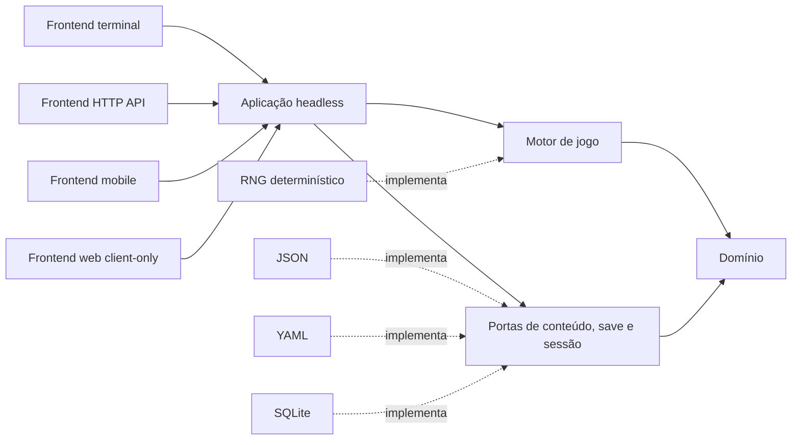

# Arquitetura proposta

## Estilo

A proposta combina arquitetura hexagonal com fluxo unidirecional de estado:

`Frontend → porta de aplicação → motor → novo estado + eventos → projeção → frontend`

Repositórios, RNG, relógio e armazenamento de sessões são portas. JSON, SQLite, HTTP, terminal e browser são adaptadores. A dependência sempre aponta para dentro.

O uso de Kotlin Multiplatform é necessário porque o frontend web client-side only deve executar as mesmas regras sem servidor. A documentação oficial confirma que lógica comum pode ser compartilhada entre JVM, Android, iOS e JavaScript, mantendo APIs de plataforma nos source sets específicos.

## Camadas

### Domínio

Contém tipos, invariantes e políticas sem dependências de framework: configuração validada, catálogo, mapa, célula, jogador, encontro, item, comandos, eventos e estado da partida.

Não contém serialização, corrotinas, arquivos, HTTP, strings de tela ou APIs de plataforma.

### Motor de jogo

Aplica um comando a um estado. Coordena geração de mapa, exploração, combate, comunicação, loot, fuga/perseguição e estados terminais. Usa portas de aleatoriedade. Seu resultado é atômico: novo estado, eventos semânticos e eventual decisão pendente.

### Aplicação headless

Gerencia ciclo de vida de partidas, revisão otimista, carregamento de conteúdo, saves e projeções. Converte eventos do domínio em uma sequência apresentável e impede que dados secretos do mapa vazem. É a API interna usada por todos os frontends.

### Portas

- repositório de conteúdo do jogo;
- repositório de saves/snapshots;
- armazenamento de sessões ativas;
- fonte de aleatoriedade;
- relógio e gerador de IDs apenas onde necessários;
- catálogo de textos/localização;
- observabilidade na borda, nunca dentro das regras.

### Adaptadores

- JSON empacotado, arquivo JVM ou asset de browser/mobile;
- YAML e SQLite opcionais;
- sessão em memória no servidor;
- terminal JVM;
- servidor HTTP JVM;
- UI mobile;
- UI web client-side only;
- armazenamento local mobile/browser para saves.

## Módulos Gradle pretendidos

| Módulo | Target principal | Responsabilidade | Pode depender de |
|---|---|---|---|
| `domain` | common | Tipos e invariantes | stdlib |
| `engine` | common | Transições e regras | `domain` |
| `application` | common | Casos de uso, sessões lógicas, projeções | `domain`, `engine`, `content-api` |
| `content-api` | common | Portas e validação de conteúdo/saves | `domain` |
| `content-json` | common + bordas | Decodificação/encoding JSON, migração de schema | `content-api`, `domain` |
| `platform-jvm` | JVM | arquivos, sessão em memória, composição JVM | módulos comuns |
| `frontend-terminal` | JVM | UI textual | `application`, `platform-jvm` |
| `frontend-api` | JVM | HTTP/JSON e concorrência de sessão | `application`, `platform-jvm` |
| `frontend-mobile` | Android/iOS | UI e armazenamento local | `application`, adaptadores mobile |
| `frontend-web` | JS ou Wasm/JS | UI client-side e armazenamento browser | `application`, adaptadores browser |
| `test-support` | common/JVM | builders, RNG roteirizado, contratos | módulos internos de teste |

Para uso racional de tokens, os quatro primeiros podem começar como source sets/pacotes claramente separados dentro de um único módulo compartilhado e só virar módulos físicos na Fase 1 se o build permanecer simples. As regras de dependência são obrigatórias mesmo antes da divisão física.

## Diagrama de dependências

## Contrato de execução

Cada chamada lógica informa identificador da partida, revisão esperada e comando. A resposta contém:

- revisão nova ou erro de conflito;
- status da partida;
- projeção visível atual;
- eventos semânticos ocorridos em ordem;
- decisão solicitada, quando houver;
- comandos atualmente permitidos.

O frontend não recebe referência mutável ao estado e não decide regras. A API HTTP e as UIs embarcadas usam o mesmo serviço; muda somente onde a sessão reside.

## Decisões interativas

Prompts que no C estão em `game.c` viram comandos ou decisões explícitas:

- mover já carrega a direção;
- trocar arma carrega o ID da arma possuída;
- comunicar carrega postura e, no suborno, valor;
- examinar sala escura carrega uso ou não da lanterna;
- seguir tripulante fugido é uma decisão pendente persistida pelo motor.

O caminho secreto de fuga não é enviado ao frontend antes da decisão. Ele fica no estado interno.

## Eventos e apresentação

Eventos representam fatos (`PlayerMoved`, `AttackMissed`, `CrewFled`, `RoomExamined`, `GameWon`) e carregam dados tipados. A aplicação os mapeia para mensagens localizadas e dicas de ritmo. Frontends podem:

- respeitar pausas dramáticas;
- reduzi-las/desligá-las por acessibilidade e testes;
- renderizar mapa e HUD de formas diferentes;
- enviar eventos estruturados pela API sem analisar texto em português.

## API como frontend

O servidor não é o backend exclusivo. Ele é um adaptador JVM que hospeda instâncias do mesmo serviço headless. Deve usar revisão otimista por partida e chave de idempotência opcional para evitar comando duplicado por retry HTTP.

Superfície mínima conceitual:

- consultar metadados/versão do conteúdo;
- criar partida com seed opcional;
- obter projeção atual;
- enviar comando com revisão esperada;
- salvar, restaurar e encerrar partida.

DTOs HTTP são separados dos tipos do domínio para permitir evolução e filtragem de dados ocultos.

## Composição por frontend

- Terminal: conteúdo JSON em arquivo/recurso, sessão local em memória, save opcional em arquivo.
- API: conteúdo JSON/SQLite, sessões em memória ou repositório de sessão, respostas DTO.
- Mobile: conteúdo empacotado, núcleo embarcado, saves locais; UI pode ser Compose Multiplatform ou nativa consumindo o serviço comum.
- Web client-side only: conteúdo empacotado/fetch de asset, núcleo compilado para browser, save em armazenamento local/IndexedDB; nenhum endpoint obrigatório.

## Referências tecnológicas

- [Kotlin Multiplatform: compartilhamento por plataformas](https://kotlinlang.org/docs/multiplatform/multiplatform-share-on-platforms.html)
- [Estrutura de projetos Kotlin Multiplatform](https://kotlinlang.org/docs/multiplatform/multiplatform-discover-project.html)
- [Ktor full-stack com Kotlin Multiplatform](https://ktor.io/docs/full-stack-development-with-kotlin-multiplatform.html)
- [SQLDelight e plataformas suportadas](https://cashapp.github.io/sqldelight/)

Versões de plugins e bibliotecas não são fixadas neste plano. A Fase 1 deve selecionar uma matriz compatível, registrá-la no catálogo de versões e protegê-la pelo build de CI.
